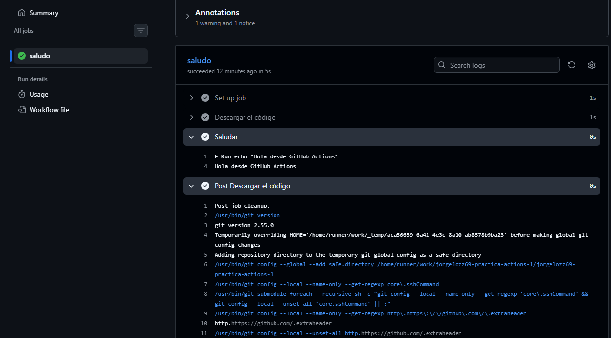
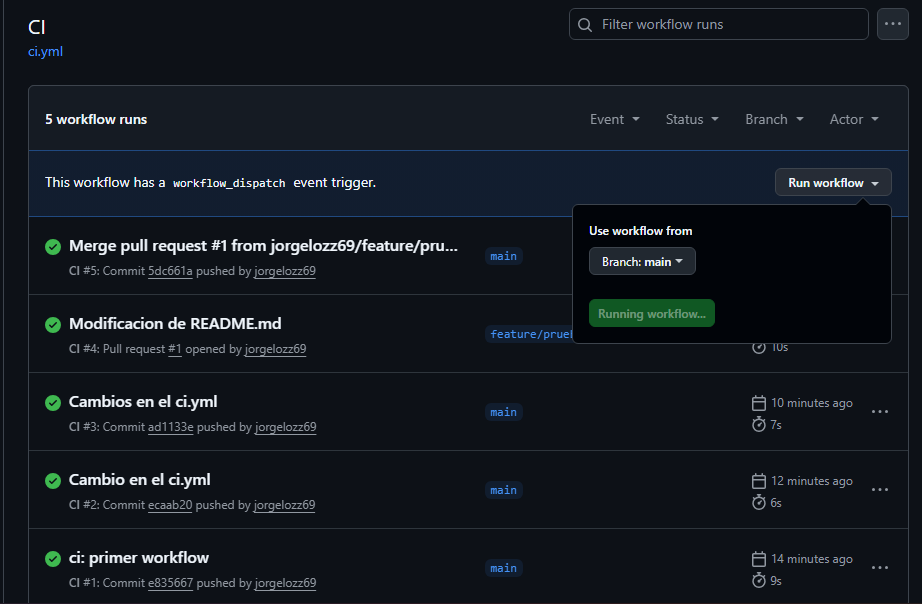
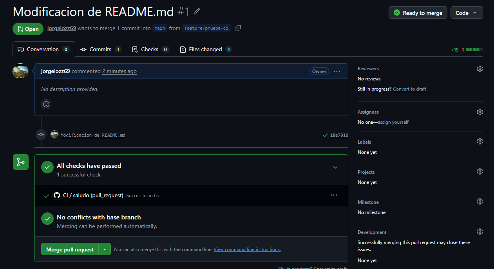

# jorgelozz69-practica-actions-1
#dsa dsadsa
Nueva linea de prueba
ddd

Captura de la pestaña Actions mostrando la ejecución disparada por push.

Captura de la ejecución disparada manualmente (workflow_dispatch).
 

Captura de la ejecución asociada a la Pull Request.

